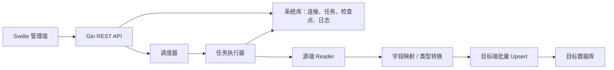

# MergeWong

面向中小规模场景的数据库表数据同步服务。项目计划以 Go 实现同步内核，以 Svelte 提供管理页面，覆盖数据库连接、全量初始化、增量同步、任务调度和运行日志。

> 当前状态：已实现 MySQL → MySQL 的全量初始化与 Binlog CDC 基础链路。生产使用前仍需完成故障注入、数据库集成测试和运行指标等[路线图](doc/ROADMAP.md)项目。

## 为什么选择 Go

本项目建议继续使用 Go，不必因为同类项目多用 Java 就改用 Java。

- Go 的数据库驱动、并发模型、静态编译和部署体积很适合单机或小集群同步服务。
- 团队熟悉度比语言生态的绝对大小更重要；不熟悉 Java 会显著提高维护成本。
- Java 的 Debezium、Flink CDC、DataX 等生态适合复杂、大规模、已有 JVM 基础设施的场景，但本项目无需从零重写这些成熟系统。
- Python 适合快速验证和编写表级转换脚本；参考项目 `manualrepl` 已证明它能监听 MySQL binlog，但长期运行、并发、类型约束和交付形态上 Go 更稳妥。

推荐方案是：**Go 单体服务 + Svelte 管理端 + 可插拔同步引擎**。当前先聚焦 MySQL Binlog CDC；若未来规模超出单体能力，再评估 Debezium/Kafka，而不是现在切换 Java。

## 已有能力与真实边界

| 能力 | 当前状态 | 说明 |
| --- | --- | --- |
| MySQL / PostgreSQL / SQL Server 连接 | 已有 | 由 GORM 管理；实际兼容性仍需集成测试 |
| 连接管理页面 | 已有 | 支持创建、测试和删除连接 |
| 全量复制 | 已有 | 按单列主键分页、500 行批量 upsert，使用独立检查点恢复 |
| MySQL Binlog CDC | 已有 | row-based Binlog，支持 insert/update/delete 与 file/position 恢复 |
| 全量 + CDC | 已有 | 先记录 Binlog 位点，再全量初始化，之后从该位点持续消费 |
| 字段映射 | 已有 | 支持简单的源字段到目标字段重命名 |
| 更新幂等写入 | 已有 | 目标端按主键 upsert，事件重放不会生成重复记录 |
| 删除同步 | 已有 | MySQL CDC 物理删除映射为目标端主键删除 |
| 独立检查点与断点续传 | 已有 | 全量和 CDC 分别维护独立检查点 |
| 任务并发与容错 | 基础完成 | 单任务互斥、CDC 取消与持久化恢复已实现，自动重试仍需加强 |
| 在线新增同步表 | 已有 | 新表独立全量初始化并追平主 Binlog 位点后合并到原链路 |
| 任务详情与进度 | 已有 | 展示总体/表级初始化百分比、行数、阶段、延迟、速率和位点 |

## 整体实现逻辑



一次全量 + CDC 任务按下面的顺序执行：

1. 预检查 Binlog、ROW/FULL 行镜像、复制权限、表结构和单列主键。
2. 在系统库记录当前 Binlog file/position。
3. 按主键稳定分页完成全量 upsert，并独立推进表检查点。
4. 从步骤 2 的位点消费行事件；按源事务在目标库提交 upsert/delete。
5. 目标事务成功后才推进 CDC 位点；崩溃窗口允许重放但不丢数据。
6. 记录读取量、写入量、耗时、检查点和错误，失败时保留上一次成功位置。

CDC 模式则将第 2～3 步替换为读取数据库变更日志，事件统一为 `insert/update/delete`，后续转换和写入链路可以复用。详细设计见[架构说明](doc/ARCHITECTURE.md)。

## 项目结构

```text
cmd/server/             服务入口、路由和优雅退出
internal/config/        YAML 配置
internal/database/      数据库连接器与连接池管理
internal/handlers/      HTTP 接口层
internal/services/      认证、连接和同步业务逻辑
internal/scheduler/     Cron 任务调度
internal/models/        系统库模型
internal/migrations/    系统表自动迁移和初始管理员
web/                    Svelte + Vite 管理端
doc/                    架构、路线图和使用文档
```

目前 Go module、部分镜像/页面名称仍保留原项目 `apiwong`，属于待清理的拷贝残留，不影响编译，但不应继续扩散。参见[路线图](doc/ROADMAP.md)。

## 本地运行

### 前置条件

- Go 1.21+
- Node.js 18+
- 一个用于保存系统元数据的 PostgreSQL 14+ 数据库

### 1. 配置

```bash
cp configs/config.yaml.sample configs/config.yaml
```

可以先用 PostgreSQL 管理员账号执行 [sql/init.sql](sql/init.sql)，创建 `mergewong` 管理库、应用账号、后台表和默认管理员：

```bash
psql -h 127.0.0.1 -p 5432 -U postgres -d postgres -f sql/init.sql
```

再编辑 `configs/config.yaml`，至少配置 `databases.system`。该库保存用户、数据源连接、同步任务与日志，不是待同步的源库或目标库。初始化脚本中的数据库默认密码仅用于首次部署，生产环境执行前必须修改。

### 2. 构建管理端

```bash
cd web
npm ci
npm run build
cd ..
```

### 3. 启动后端

```bash
go run ./cmd/server
```

访问 `http://localhost:8080`；健康检查为 `GET /health`。首次启动会创建管理员 `admin / admin123`，请立即修改密码。

也可以使用国内镜像源进行本地 Docker 构建：

```bash
./script/dockerbuild.sh
# Windows PowerShell 也可直接执行：
docker compose -f docker-compose-local.yml up -d --build
```

## 镜像发布与服务器部署

发布采用 Git 标签触发：GitHub Actions 使用正式 `Dockerfile` 构建 `linux/amd64` 和 `linux/arm64` 镜像，并同时推送到 GHCR 与阿里云 ACR。普通分支 push 不发布镜像。

阿里云创建命名空间和镜像仓库 `mergewong` 后，在 GitHub 仓库的 Actions secrets 中配置：

| Secret | 示例 / 说明 |
| --- | --- |
| `ALIYUN_USERNAME` | ACR 登录用户名 |
| `ALIYUN_PASSWORD` | ACR 固定密码或访问凭据 |
| `ALIYUN_NAMESPACE` | 阿里云镜像命名空间，不含 registry 地址 |

工作流当前默认使用杭州区域 `registry.cn-hangzhou.aliyuncs.com`；若仓库建在其他区域，修改 [.github/workflows/release.yml](.github/workflows/release.yml) 中的 `ALIYUN_REGISTRY`。

创建并推送下一个补丁版本标签：

```bash
./script/release.sh            # 自动从最新标签递增 patch
./script/release.sh v0.2.0     # 指定版本
# Windows
./script/release.ps1 v0.2.0
```

发布脚本要求工作区干净，并先运行 Go 测试和前端构建。标签推送后可在 GitHub Actions 查看双仓库发布结果。

服务器部署时复制 `docker-compose.yml`、`configs/config.yaml`，并按需要将 `.env.deploy.example` 复制为 `.env`。使用阿里云镜像示例：

```dotenv
MERGEWONG_IMAGE=registry.cn-hangzhou.aliyuncs.com/your-namespace/mergewong:latest
MERGEWONG_PORT=8080
```

```bash
./script/redeploy.sh deploy     # 拉取并重建容器
./script/redeploy.sh logs       # 查看日志
./script/redeploy.sh status     # 查看状态
```

Windows 对应使用 `script/redeploy.ps1`。私有仓库首次部署前，需要先在服务器执行 `docker login registry.cn-hangzhou.aliyuncs.com`。

常用脚本：

| 脚本 | 用途 |
| --- | --- |
| `start.sh` / `start.ps1` | 本机编译前端并用 Go 启动服务 |
| `dockerbuild.sh` | 使用 `DockerfileLocal` 构建并启动本地容器 |
| `release.sh` / `release.ps1` | 测试、自动打标签并推送远程 |
| `redeploy.sh` / `redeploy.ps1` | 服务器拉镜像、部署、看日志 |
| `docker-prune.sh` / `docker-prune.ps1` | 确认后清理未使用的 Docker 资源 |

## 开发验证

```bash
go test ./...
cd web && npm run build
```

当前 Go 包可以通过编译测试，但尚无单元测试和数据库集成测试。因此“测试通过”目前只代表编译通过，不代表同步语义正确。

## 文档

- [架构与现状分析](doc/ARCHITECTURE.md)
- [实现路线图](doc/ROADMAP.md)
- [同步任务向导与多表同步计划](doc/TASK_WIZARD_ROADMAP.md)
- [快速开始](doc/QUICKSTART.md)
- [AI / 开发协作说明](AGENTS.md)

## 安全提醒

- 生产环境必须更换 JWT secret 和默认管理员密码。
- 动态数据库连接密码当前以明文写入系统库，系统库连接密码也以明文存在本地配置；生产使用前必须增加可轮换的加密存储，并且不要提交真实配置。
- 通用 SQL 执行接口权限很大，生产环境应增加角色权限、审计和 SQL 限制。
- 表名、列名来自任务配置，正式实现必须做标识符校验与数据库方言转义。

## License

MIT
